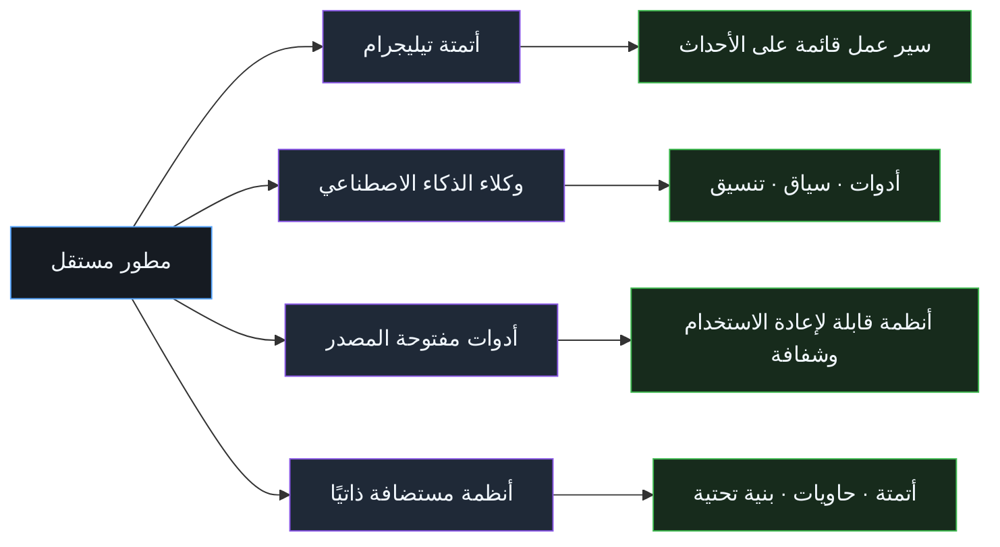

<!--
  Profile README — walid-zd213
  النسخة العربية
  حافظ على تطابق الهيكل مع README.md
-->

# وليد · مطوّر مستقل

### أتمتة تيليجرام · وكلاء الذكاء الاصطناعي · الأنظمة مفتوحة المصدر

  

  
  
  
  

---

## نبذة

أنا مطوّر مستقل وباحث تقني أركز على بناء أنظمة ذكية وعملية ومفتوحة.

يدور اهتمامي حول الأتمتة، والبرمجيات القائمة على الوكلاء، والبنية ذاتية الاستضافة، والتجارب المفتوحة المصدر.

أهتم بتحويل الأفكار المعقدة إلى أدوات موثوقة، وسير عمل قابلة لإعادة الاستخدام، وأنظمة تقنية سهلة الفهم.

---

## مجالات التركيز

<table>
<tr>
<td width="33%" valign="top">

### أتمتة تيليجرام

تصميم بوتات تيليجرام وسير عمل مؤتمتة مع التركيز على:

- التفاعلات القائمة على الأحداث
- أنظمة الأوامر وسير العمل
- العمليات الخلفية الموثوقة
- تجارب الاستخدام العملية
- البنى القابلة للتوسع

</td>
<td width="33%" valign="top">

### وكلاء الذكاء الاصطناعي

استكشاف الأنظمة التفاعلية والبنى القائمة على الوكلاء، بما في ذلك:

- الوكلاء القادرون على استخدام الأدوات
- تنسيق الوكلاء المتعددين
- سير العمل المدرك للسياق
- أنظمة الاسترجاع المعزز
- أنماط التفاعل بين الإنسان والذكاء الاصطناعي

</td>
<td width="33%" valign="top">

### الأنظمة المفتوحة

بناء ودراسة تقنيات شفافة وقابلة للتكيف وقابلة للاستضافة الذاتية من خلال:

- أدوات المصادر المفتوحة
- البيئات المستضافة ذاتيًا
- الأنظمة المعتمدة على الحاويات
- بنية الأتمتة
- سير العمل القابلة لإعادة الإنتاج

</td>
</tr>
</table>

---

## الاتجاه التقني

```mermaid
flowchart LR
    A[مطور مستقل] --> B[أتمتة تيليجرام]
    A --> C[وكلاء الذكاء الاصطناعي]
    A --> D[أدوات مفتوحة المصدر]
    A --> E[أنظمة مستضافة ذاتيًا]

    B --> F[سير عمل قائمة على الأحداث]
    C --> G[أدوات · سياق · تنسيق]
    D --> H[أنظمة قابلة لإعادة الاستخدام وشفافة]
    E --> I[أتمتة · حاويات · بنية تحتية]

    classDef identity fill:#161b22,stroke:#58a6ff,color:#f0f6fc;
    classDef focus fill:#1f2937,stroke:#8957e5,color:#f0f6fc;
    classDef direction fill:#172b1c,stroke:#3fb950,color:#f0f6fc;

    class A identity;
    class B,C,D,E focus;
    class F,G,H,I direction;
```
---

---

---

<!-- قسم التقنيات -->
### 🧰 التقنيات المستخدمة

  
  
  
  

  
  
  
  

  
  
  
  

### 📊 إحصائيات النشاط

